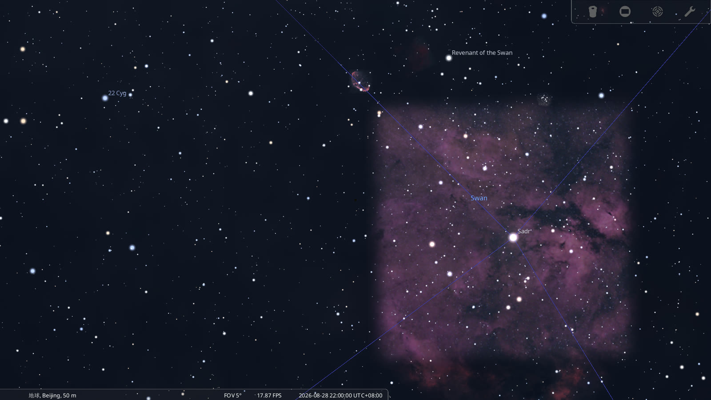
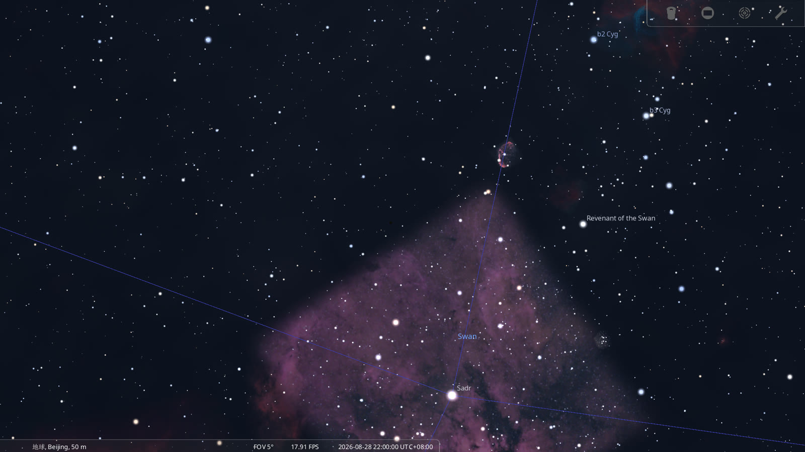

# Historical Sky for Stellarium

Recreate the night sky for any historical date, time and location using Stellarium scripts.

The script sets the observer location, the date and time, pauses the simulation, and
configures the sky for historical observation — constellation lines, constellation labels,
landscape and atmosphere on. An optional variant also points the view at the zenith, where
the star closest to straight-up sits.

**Tested with Stellarium 26.2** · MIT License · Created by [A Star Named](https://astarnamed.com/?utm_source=github&utm_medium=readme&utm_campaign=historical-sky)



*Beijing, 2026-08-28 22:00 local time — the Cygnus Milky Way overhead, set by `historical_sky.ssc`.*

## Install

1. Download Stellarium from https://stellarium.org (26.2 or newer).
2. Copy `historical_sky.ssc` and `historical_sky.inc` into your Stellarium *scripts* folder
   (inside the User Data Directory):
   - **Windows:** `%APPDATA%\Stellarium\scripts\`
   - **macOS:** `~/Library/Application Support/Stellarium/scripts/`
   - **Linux:** `~/.stellarium/scripts/`

   See the Stellarium User Guide, section 5 ("Files and Directories"), for the exact
   location on your system.
3. In Stellarium, press **F12** to open the Script Console, select `historical_sky.ssc`,
   and press **Run**.

## Configure

Edit `historical_sky.inc` — no other file needs touching:

```javascript
var SKY_DATE = "2026-08-28T14:00:00";  // UTC (14:00 UTC = 22:00 in Beijing, UTC+8)
var SKY_LON  = 116.4074;               // longitude, east positive
var SKY_LAT  = 39.9042;                // latitude, north positive
var SKY_ALT  = 50;                     // altitude above sea level, metres
var SKY_NAME = "Beijing, China";       // label shown in Stellarium
```

Then run `historical_sky.ssc` again.

**Why UTC:** Stellarium gives a custom observer location its own time zone, which may be
local mean time (for Beijing that is UTC+7:45:38, not UTC+8) — a "local" time can therefore
land ~15 minutes off. Setting the time in UTC is exact. Convert with
`UTC = local time − UTC offset`.

## Examples

`examples/` contains three ready-to-run, self-contained scripts — copy one file into your
scripts folder and Run:

| File | Sky (UTC set in the script) |
|---|---|
| `beijing-2026.ssc` | 2026-08-28 22:00 CST (14:00 UTC) — Beijing, China |
| `london-2020.ssc` | 2020-06-15 22:00 BST (21:00 UTC) — London, UK |
| `new-york-2010.ssc` | 2010-07-04 22:00 EDT (02:00 UTC Jul 5) — New York, USA |

## Zenith Star (optional)

`historical_sky_zenith.ssc` runs the same setup, then looks straight up and zooms in: the
catalog star closest to the zenith for that date/time/location sits within a few tenths of
a degree of the view centre.

The catalog ID, magnitude and angular distance for your own date/time/location can be
computed with the free calculator at A Star Named —
https://astarnamed.com/death-sky/calculator?utm_source=github&utm_medium=readme&utm_campaign=historical-sky —
then copied into `zenith_star.inc`.



*Same date/time/location, centred on HIP 99571 (Cygnus) — 0.13° from the zenith.*

Note: near the zenith, azimuth is ill-defined, so the script points at the zenith itself
rather than at a bearing — the target star is within `ZS_DIST_DEG` of the centre.

## Compatibility

Stellarium's scripting API evolves between releases. This project is tested with 26.2 and
re-checked after major Stellarium updates. If a call fails on your version, open the Script
Console (F12) — errors are reported there.

## License

MIT — see [LICENSE](LICENSE). Scripts are additionally offered as CC0 if a Public Domain
dedication is preferred; open an issue if you need that.

## About

Built for historical sky reconstruction and astronomy education — for historians,
educators, and anyone who wants to see the sky over a particular date and place.
Created and maintained by A Star Named.
